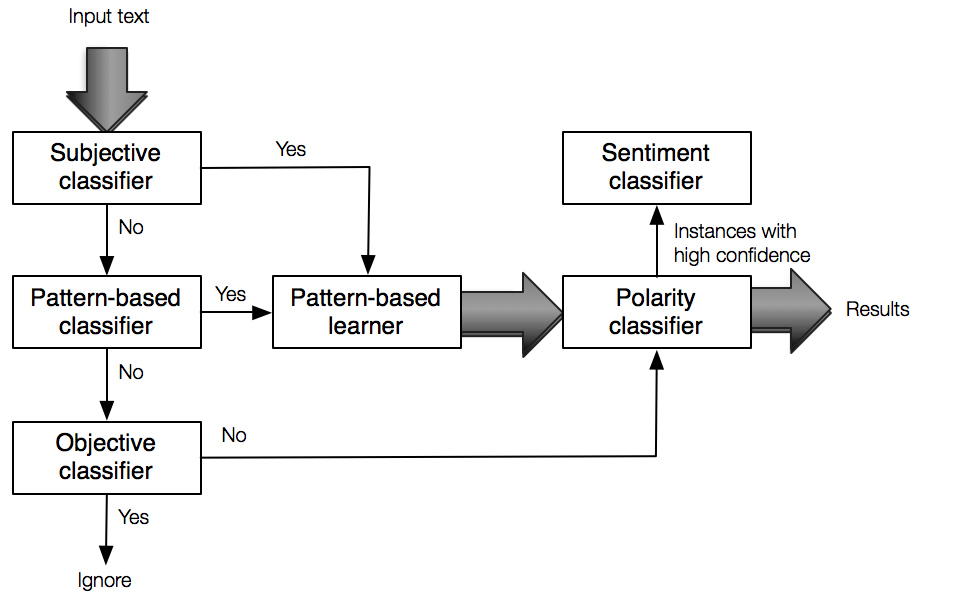

<b>usent</b> — The attached code is a Python implementation of a dictionary-based sentiment classification procedure which combines two different bootstrapping procedures, namely for subjectivity and polarity detection (as in [<a href="http://www.cs.utah.edu/~riloff/pdfs/emnlp03.pdf">3</a>, <a href="http://www.lsv.uni-saarland.de/wassa.pdf">4</a>] respectively). The rule-based polarity classifier is an extension of the one that was presented in [<a href="http://people.cs.pitt.edu/~wiebe/pubs/papers/emnlp05polarity.pdf">5</a>].

- E. Riloff and J. Wiebe. Learning extraction patterns for subjective expressions.
In Proceedings of the 2003 conference on Empirical methods in natural language
processing, 2003.  <br />
- D. K. M Wiegand. Bootstrapping supervised machine-learning polarity classifiers with rule-based classification. 
In Proceedings of the ECAI-Workshop on Computational Approaches to Subjectivity and Sentiment Analysis, 2009.  <br />
- T. Wilson, J. Wiebe, and P. Hoffmann. Recognizing contextual polarity in phrase-level sentiment 
analysis. In Proceedings of the conference on Human Language Technology and Empirical Methods in 
Natural Language Processing, 2005. <br />

The code was used for an opinion mining and retrieval system presented at CICLing 2013 [<a href="http://publications.idiap.ch/downloads/papers/2013/Pappas_CICLING_2013.pdf">1</a>],  and for improving one-class collaborative filtering [<a href="http://publications.idiap.ch/downloads/papers/2013/Pappas_SIGIR_2013.pdf">2</a>]. There is also a folder called /TED_comment_annotations that contains the files of the human study we conducted on TED comment sentiment classification (with 6 human annotators).  

```
@incollection{pappas13c,
 location = {Samos, Greece},
 year = {2013},
 booktitle = {Computational Linguistics and Intelligent Text Processing},
 volume = {7817},
 doi = {10.1007/978-3-642-37256-8_17},
 title = {Distinguishing the Popularity between Topics: A System for Up-to-Date Opinion Retrieval and Mining in the Web},
 author = {Pappas, Nikolaos and Katsimpras, Georgios and Stamatatos, Efstathios},
 pages = {197-209}
}

@inproceedings{pappas13a,
 author = {Pappas, Nikolaos and Popescu-Belis, Andrei},
 title = {Sentiment Analysis of User Comments for One-Class Collaborative Filtering Over {TED} Talks},
 booktitle = {Proceedings of the 36th international ACM SIGIR conference on Research and development in information retrieval},
 series = {SIGIR '13},
 year = {2013},
 isbn = {978-1-4503-2034-4},
 location = {Dublin, Ireland},
 pages = {773--776},
 numpages = {4},
} 
```


Installing dependencies
------------
The available code for unsupervised sentiment classification requires Python programming 
language and pip package manager to run. For detailed installing instructions please refer to 
the following links: <br />
http://www.python.org/getit/ <br />
http://www.pip-installer.org/en/latest/

After installing them, you should be able to install the following packages: <br />
```bash
$ pip install nltk  
$ pip install stemmer 
$ pip install numpy
$ pip install pickle 
```

After you install nltk you will need some corpora to train the sequential POS tagger (pos.py) and the nltk tokenizer.
```bash
$ python 
```
```python
import nltk 
nltk.download() 
```  
The issue of the above command will load a graphical interface that lets you manage several corpora
related to nltk library. From the list select and download the following corpora: 
*tokenizers/punkt/english*, *wordnet*, *brown*, *conll2000* and *treebank*. 

Lastly, pyml library is needed for the SVM classifier that is used currently in our code. <br />
Download http://pyml.sourceforge.net/ and then issue: <br />
```bash 
 $ tar zxvf PyML-0.7.11.tar.gz
 $ cd PyML-0.7.11
 $ python setup.py build
 $ python setup.py install 
```


Processing pipeline
-------------------
The current pipline that is implemented in sentiment.py is depicted in the following diagram. Initially,
the input text is split into sentences and each sentence is fed to a high precision subjectivity classifier.
If the sentence is classified as subjective then syntactic patterns are learned from this instance. In case 
that the sentence is not detected as such then it is fed to the pattern-based classifier. The pattern-based
classifier outputs the class of the sentence based on the learned patterns so far. If the instance is subjective
then again more patterns are learned from it, otherwise it is fed to a high precision objectivity classifier.
If the sentence is classified as objective, then it is ignored, otherwise it is fed to the polarity classifier.
Finally, the polarity classifier estimates the numerical sentiment and normalized sentiment values and outputs
the result. The instances with high confidence from the polarity classifier can be further used to train an SVM 
classifier to improve further the classification performance (see paper for further details). At the current version
this option is disabled, but you can easily enable it. Similarly, you can remove some of the components from the 
pipeline according to your needs (e.g. skip subjectivity classification).

<p align="center">

</p>

Examples
--------
To estimate the total sentiment and total normalized sentiment (as described in the papers), 
you can simply execute the sentiment.py file and give the desired block of text as an argument.
Make sure that you escape symbols such as '"' and '!'. Apart from the command line execution you 
can integrate the library to your code and use directly the returned results. Below you can 
find two simple examples for demonstrating purposes:

```bash
$ python sentiment.py "I have to give much love and respect to Rony. Your work is Amazing\\!"
```
```
[+] Loaded existing UBT tagger!
[+] Loaded existing pattern knowledge!

[*] Checking block of text:
[1] I have to give much love and respect to Rony.
[2] Your work is Amazing!

[*] Overall sentiment analysis:

 Parts:  2
 Sentiments:  ['positive', 'positive']
 Scores:  [4, 6.0]
 Results:  {'positive': {'count': 2, 'score': 10.0, 'nscore': 1.9},
	    'neutral': {'count': 0, 'score': 0, 'nscore': 0},
	    'negative': {'count': 0, 'score': 0, 'nscore': 0}}


 subjective-----> 100.00%
 objective------> 0.00%


 positive-------> 100.00%
 neutral--------> 0.00%
 negative-------> 0.00%

[x] positive (10.00, 1.90)
```


```bash
$ python sentiment.py "I was blown away by some of the comments here posted by people who is either 
uneducated, ignorant, self-righteous or al-of-the-above. I'm irritated and saddened as I read these 
finger-pointing \"i'm right and you're wrong\" type of posts\!"
```
```
[+] Loaded existing UBT tagger!
[+] Loaded existing pattern knowledge!

[*] Checking block of text:
[1] I was blown away by some of the comments here posted by people who is either uneducated, ignorant, self-righteous or al-of-the-above.
[2] I'm irritated and saddened as I read these finger-pointing "i'm right and you're wrong" type of posts!

[*] Overall sentiment analysis:

 Parts:  2
 Sentiments:  ['negative', 'negative']
 Scores:  [-4, -4.0]
 Results:  {'positive': {'count': 0, 'score': 0, 'nscore': 0},
	    'neutral': {'count': 0, 'score': 0, 'nscore': 0},
	    'negative': {'count': 2, 'score': -8.0, 'nscore': -0.3722943722943723}}


 subjective-----> 100.00%
 objective------> 0.00%


 positive-------> 0.00%
 neutral--------> 0.00%
 negative-------> 100.00%

[x] negative (-8.00, -0.37)
```

